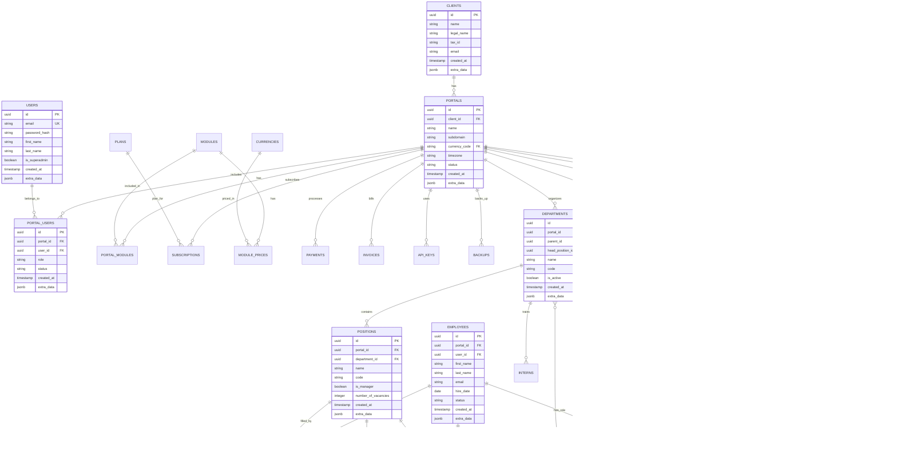

# Проектирование базы данных для SaaS-платформы

## 1. Обзор архитектуры

База данных спроектирована для SaaS-платформы с поддержкой:
- **Мультиарендность**: изоляция данных клиентов через `portal_id` во всех таблицах
- **Модульность**: независимые модули с возможностью подключения через `portal_modules`
- **Масштабируемость**: подготовка к шардингу и возможность горизонтального масштабирования
- **Гибкость**: использование JSONB полей для расширения без изменения структуры
- **Версионность**: хранение нескольких версий ключевых структур

## 2. ER-диаграмма

## 3. Описание таблиц и модулей

### Ядро платформы

#### Клиенты и порталы
- `clients` - Клиенты (компании), использующие платформу
- `portals` - Изолированные среды для каждого клиента с индивидуальными настройками
- `currencies` - Справочник валют для мультивалютности

#### Пользователи и аутентификация
- `users` - Глобальные пользователи платформы (один email может быть в нескольких порталах)
- `portal_users` - Связь между пользователями и порталами с ролями и доступами

#### Модули и подписки
- `modules` - Доступные модули системы
- `portal_modules` - Модули, подключенные к конкретному порталу
- `plans` - Тарифные планы для клиентов
- `subscriptions` - Подписки клиентов на тарифные планы
- `module_prices` - Цены модулей в разных валютах

#### Биллинг и платежи
- `payments` - История платежей клиентов
- `invoices` - Счета, выставленные клиентам

#### Интеграции и безопасность
- `api_keys` - API ключи для интеграций
- `backups` - Резервные копии данных портала
- `log_actions` - Журнал действий пользователей и системы

### Модуль структуры компании

#### Организационная структура
- `departments` - Отделы компании с иерархической структурой
- `positions` - Должности (позиции) в отделах
- `employees` - Сотрудники компании
- `employee_positions` - Назначения сотрудников на должности

#### Функциональные элементы
- `functions` - Функциональные обязанности должностей
- `vacancies` - Вакансии компании
- `interns` - Стажеры компании
- `reserves` - Кадровый резерв компании

#### Роли и доступы
- `department_roles` - Роли в отделах компании
- `employee_department_roles` - Назначение ролей сотрудникам в отделах
- `structure_settings` - Настройки структуры компании
- `visibility_settings` - Настройки видимости элементов структуры
- `access_rights` - Права доступа к элементам системы

#### Версионность
- `structure_versions` - Версии структуры компании (хранение 5 последних)

### Представления (Views)
- `current_company_structure` - Представление текущей структуры компании
- `active_portal_modules` - Представление активных модулей портала

## 4. Рекомендации по реализации

### Индексирование и производительность
- Индексы на всех полях `portal_id` для эффективной фильтрации данных конкретного клиента
- Индексы на `email` и других часто используемых для поиска полях
- Индексы на полях `created_at` для временных запросов и отчетности
- Полнотекстовые индексы для поиска по именам (GIN для PostgreSQL)

### Безопасность и изоляция данных
- Ролевая модель доступа на уровне приложения
- Обязательная проверка `portal_id` во всех запросах к базе данных
- Использование Row Level Security (RLS) в PostgreSQL для дополнительной защиты
- Хранение хешей паролей с использованием bcrypt или argon2

### Масштабирование
- Шардинг по `portal_id` - подготовка архитектуры к распределению данных по серверам
- Вертикальное партиционирование таблиц с большим количеством данных
- Архивные таблицы для старых/неактивных данных
- Репликация "только для чтения" для распределения нагрузки на чтение

### Миграция и обслуживание
- Использование миграций для контроля версий схемы базы данных
- Инкрементальные изменения для обеспечения непрерывности работы
- Резервное копирование на уровне портала для возможности восстановления

## 5. Подготовка к коробочной версии

### Архитектурные решения
- Использование UUID для идентификаторов (вместо автоинкрементных ID) для упрощения синхронизации
- Поле `extra_data` типа JSONB для расширения без изменения схемы
- Четкое разделение модулей с минимальными зависимостями между ними

### Интеграционные возможности
- API-интерфейсы для каждого модуля
- Поддержка экспорта и импорта данных в стандартных форматах
- Независимость от конкретных внешних сервисов

### Миграция данных
- Возможность экспорта/импорта всех данных портала
- Поддержка миграции между облачной и коробочной версиями
- Сохранение исторических данных и версий при миграции